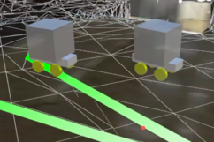
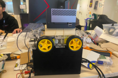

# Medical Robot

Contributors: Nhan Tran, Charles Xu, Veronica Bot, Jose Pimentel

- This repo contains the source for Unity, ROS2 package (middleware) and Firmware (running on ESP32), and Assets (Blender)

# Instruction:

- Please clone all submodule after your first `git clone`
    - `git submodule update --init --recursive`

